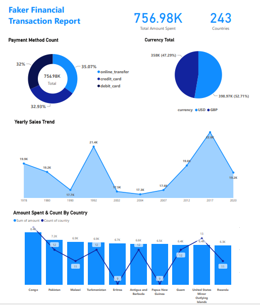

# End-2-End Online Transaction Data Pipeline with Faker Dataset, S3, AWS Glue, Athena, Redshift, Airflow, and Docker 

The pipeline runs a Python script to generate online transaction dataset, which is loaded into Amazon S3. An AWS Glue crawler captures and stores metadata in the AWS Glue Data Catalog. Users can query the S3 data through Amazon Athena and perform data warehousing analytics by connecting to Amazon Redshift. External tools like Power BI can further analyze data stored in Redshift.

This project follows data engineering best practices by using the following
- Docker for containerization
- Config file for Configurable Pipeline
- Logging for Monitoring & Debugging
- Error Handling

## Architecture


## Prerequisites
- AWS account
- Python3.9 or higher
- Docker with at least 4GB of RAM and Docker Compose v1.27.0 or later

## System Setup

1. Clone the repository
``` bash
    git clone https://github.com/heiskabeer/Online-Transaction-ETL-Pipeline.git
```
2. Create a virtual Ennvironment
``` bash
    python -m venv venv
```
3. Install the dependencies.
```bash
    pip install -r requirements.txt
```
4. Build the Dockerfile
```bash
    docker compose build
```
5. Start the Container 
```bash
    docker compose up -d
```
## BI DashBoard


## Insights From Analysis
**Note that these insights are generated from a fake  dataset, hence; are not real.**

- The dataset encompasses transactions from a comprehensive set of **243 countries**.
- The cumulative recorded transactions amount to a substantial figure of **757K**.
- **Online transactions** emerge as the predominant payment method, constituting **35%** of the overall usage.
- Notably, the year **2017** exhibits a significant upsurge in transactional activity, marking it as the peak period within the dataset.
- The Republic of Congo stands out as the leading country in terms of transaction volume, indicating a noteworthy level of economic activity.
- The United States holds the second position in the total count of transactions. However, when considering the monetary aspect, it ranks 9th, indicating a trend where transactions from the United States are numerous but tend to be of smaller magnitudes.


## Other Snapshots


