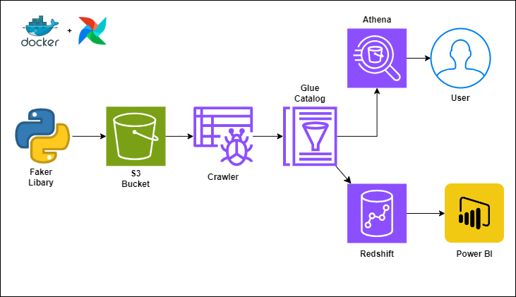
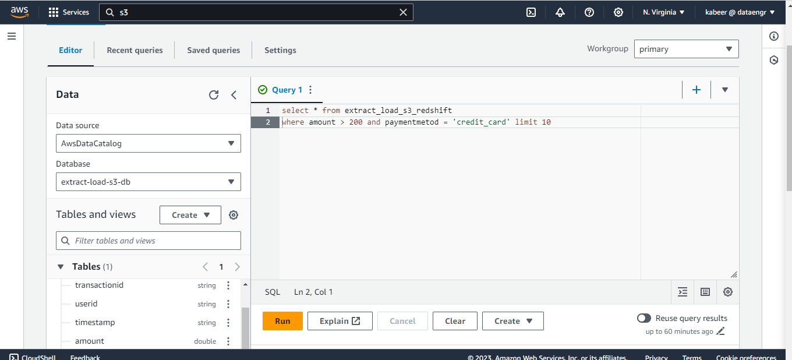
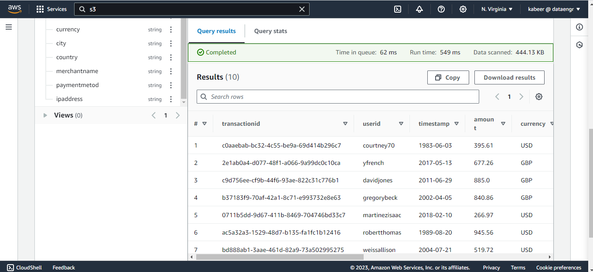
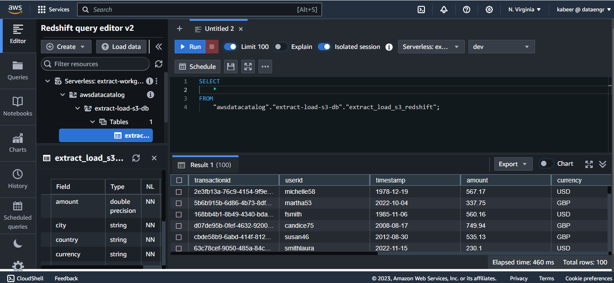

# Online Transaction Data Pipeline with Faker Dataset, S3, AWS Glue, Athena, Redshift, Airflow, and Docker 

The pipeline runs a Python script to generate online transaction dataset, which is loaded into Amazon S3. An AWS Glue crawler captures and stores metadata in the AWS Glue Data Catalog. Users can query the S3 data through Amazon Athena and perform data warehousing analytics by connecting to Amazon Redshift. External tools like Power BI can further analyze data stored in Redshift.

This project follows data engineering best practices by using the following
- Docker for containerization
- Config file for Configurable Pipeline
- Logging for Monitoring & Debugging
- Error Handling

## Architecture



## Prerequisites
- AWS account
- Python3.9 or higher
- Docker with at least 4GB of RAM and Docker Compose v1.27.0 or later

## System Setup

1. Clone the repository
``` bash
    git clone https://github.com/heiskabeer/Online-Transaction-ETL-Pipeline.git
```
2. Create a virtual Ennvironment
``` bash
    python -m venv venv
```
3. Install the dependencies.
```bash
    pip install -r requirements.txt
```
4. Build the Dockerfile
```bash
    docker compose build
```
5. Start the Container 
```bash
    docker compose up -d
```
# Snapshots


